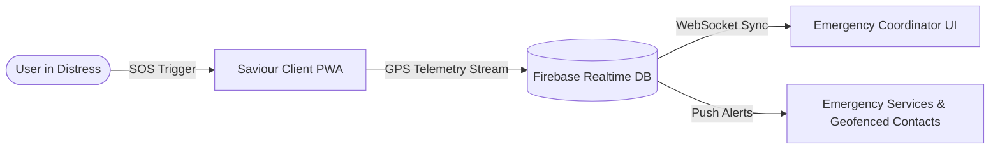

# 🚨 Saviour — Real-Time Geospatial Emergency Locator

[](https://react.dev/)
[](https://firebase.google.com/)
[](https://leafletjs.com/)

Saviour is an offline-capable, high-performance Progressive Web Application (PWA) designed for immediate emergency broadcast coordination, dynamic location telemetry sharing, and spatial safety geofencing.



## ⚡ Core Systems
- **Geospatial Telemetry Stream**: Continuous high-accuracy GPS tracking synced dynamically via WebSockets.
- **Offline-First PWA Support**: Service worker caching allows SOS triggers and interface loads even in offline environments.
- **Real-time Map Visualizations**: Leaflet integration plotting live tracks of active incidents.

## 🛠 Tech Stack
- **Client App**: React JS, Tailwind CSS, Progressive Web App configuration.
- **Realtime Database**: Firebase Realtime DB and Authentication.
- **Cartographic Engines**: OpenStreetMap API & Leaflet JS.

## 🚀 Setup Instructions
1. Configure your Firebase project parameters in `src/firebase.js`.
2. Launch dev servers:
   ```bash
   npm install && npm start
   ```

## 📜 License
MIT License. Developed by Kalyan Reddy.
